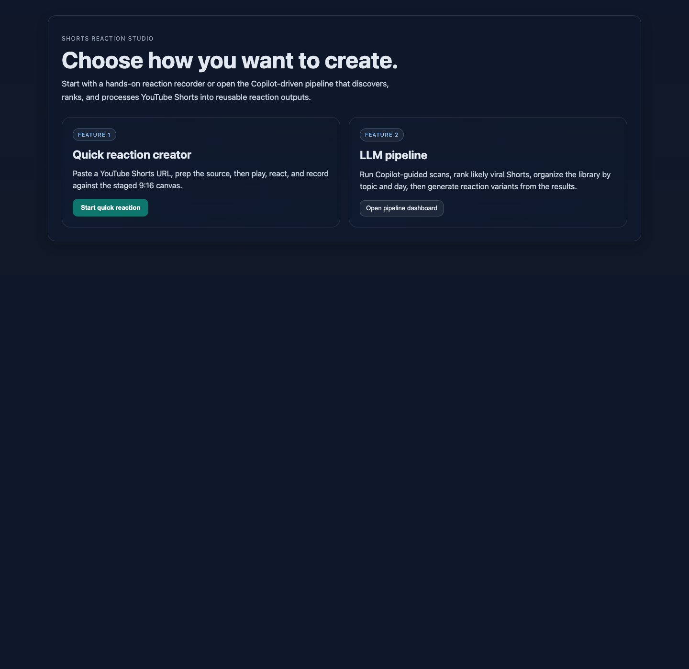
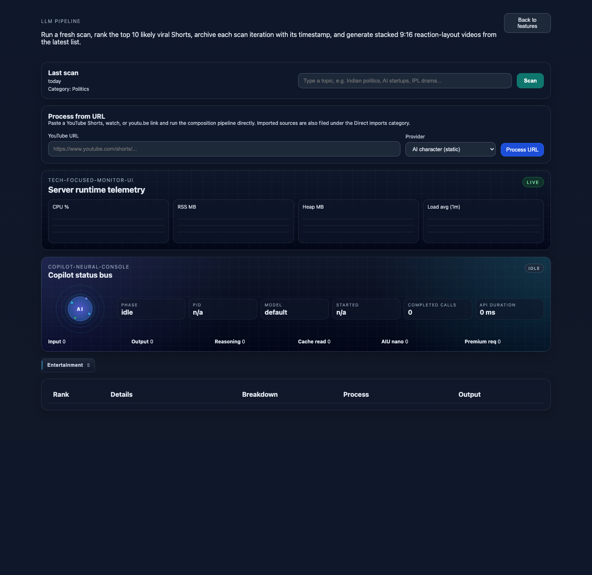

# YouTube Shorts Reaction Studio

This repository ships a **two-part product flow** for making reaction content from YouTube Shorts:

1. **Quick reaction path** — paste a YouTube URL in the pipeline, choose a user-media provider, then jump into the advanced recorder to **play, react, and record** locally.
2. **LLM-driven trending-video pipeline** — scan a topic, let Copilot discover and rank likely viral Shorts, then **generate reaction outputs automatically** with the built-in processing pipeline.

Both surfaces are exposed from the same app, share the same Node/React stack, and reuse the same downloader, provider, and 9:16 composition pipeline.

## Product surfaces at a glance

| Surface | Route | What it is for |
| --- | --- | --- |
| Feature chooser | `/` | Landing page that lets you choose between the two major workflows |
| LLM pipeline dashboard | `/pipeline` | Copilot-driven discovery, ranking, categorization, direct URL processing, and automated reaction generation |
| Advanced reaction recorder | `/advanced/user-reaction` | Immersive 9:16 stage opened from the pipeline when you choose a user-media provider |

## Screenshots

### Feature chooser



### LLM pipeline dashboard



## Surface 1: Quick reaction path

The quick-reaction path is for a creator who already knows which Short they want to respond to and wants the fastest path to a staged recording.

### What it actually does

1. Open `/pipeline`.
2. Paste a YouTube Shorts, watch, or `youtu.be` URL into **Process from URL**.
3. Choose a **user-media** provider.
4. Open the advanced recorder.
5. Turn the camera on, start recording, and manually play or pause the source video.
6. Save the draft to open the captured stage output in a new browser tab.

### Recorder behavior

The advanced recorder captures the **rendered 9:16 stage**, not just the raw webcam feed:

- source video is shown in the **top 60%**
- your camera feed is shown in the **bottom 40%**
- microphone audio and source audio are mixed into the recording when available
- playback is manual, so the creator decides exactly when to react
- save is preview-first: the recorded draft opens in a new tab instead of immediately entering a background render flow

### Quick reaction capture modes

- **User media**
- **User media + sunglasses**
- **User media + pixelated**

Use this path when the goal is: **I already have a Short; let me play, react, and record right now.**

## Surface 2: LLM-driven trending-video pipeline

The pipeline side of the product is for discovery, ranking, organization, and reusable reaction generation.

### What it actually does

1. Accepts a free-text topic from the CLI or UI.
2. Uses Copilot to turn that topic into practical YouTube Shorts search queries.
3. Collects candidate Shorts through a **hybrid source strategy**:
   - primary: YouTube Data API
   - fallback: Playwright-driven YouTube page scraping
4. Keeps only candidates that are currently:
   - **10 to 180 seconds** long
   - **comments enabled**
5. Uses Copilot again to review candidates for:
   - relevance
   - spam rejection
   - keep/drop decisions
   - virality scoring
   - short rationale and confidence
6. Rebuilds the semantic category library so stored results can be regrouped, split, renamed, or reused by topic.
7. Persists ranked outputs to local JSON dumps and markdown reports.
8. Serves the `/pipeline` dashboard so you can browse categories, inspect the latest records, delete entries, or process them into reaction videos.
9. Supports **Process from URL** so a single pasted Short can go through the same processing pipeline without waiting for a scan.

### Automated reaction generation

From the pipeline UI, each ranked Short or direct import can be processed into a stacked **9:16 reaction output**.

Current processing providers:

| Provider | What it does |
| --- | --- |
| **AI character (static)** | Reuses a local server-hosted reaction clip from `data/static/ai-character` |
| **User media** | Opens the advanced recorder and uses your captured stage output as the lower reaction layer |
| **User media + sunglasses** | Uses the same browser recorder with a live sunglasses anonymizer |
| **User media + pixelated** | Uses the same browser recorder with a pixelation anonymizer |
### Composition behavior

When a processing job runs, the backend:

1. downloads the source Short
2. asks the selected provider for a reaction-layer video
3. composites a **9:16** output with the source on top and the reaction on the bottom
4. starts the reaction layer immediately
5. delays the source playback by **4 seconds**
6. preserves available audio and mixes tracks when both sides contain audio
7. writes job artifacts under `data/generated/jobs/`

If `data/static/ai-character/end.mp4` exists, the composition also supports the optional outro flow used by the static AI-character provider.

Use this surface when the goal is: **Find interesting Shorts, rank what matters, and generate reaction-ready outputs from the resulting library.**

## What Copilot is responsible for

This is not just a scraper with a small prompt on top. Copilot is used in the decision-heavy parts of the product:

1. **Query planning** — expand a loose topic into useful search terms.
2. **Candidate review** — decide which Shorts are relevant, spammy, or worth keeping.
3. **Virality judgment** — add confidence, reasoning, and virality scoring.
4. **Category recategorization** — rebuild the topic library when a broader category needs to split or be renamed.
5. **Report writing** — generate a markdown summary for each scan iteration.

The deterministic code handles collection, normalization, persistence, and video composition. Copilot handles the meaning-heavy judgment.

## Quickstart

```bash
npm install
cp .env.example .env
```

Optional but recommended for the browser fallback path:

```bash
npx playwright install chromium
```

Run a Copilot-driven scan and launch the UI:

```bash
npm run copilot:scan -- --query "indian politics" --max-results 5 --serve-ui
```

The local server runs on `http://localhost:3000` by default.

Once the server is running:

- open `/` to choose a product surface
- open `/pipeline` to run discovery, direct URL processing, and the quick-reaction recorder flow

If you already have dump data and only want to serve the app:

```bash
npm run build
npm run serve
```

## Key scripts

| Script | Purpose |
| --- | --- |
| `npm run scan -- --query "topic"` | Runs the pipeline and writes JSON dumps plus a markdown report |
| `npm run copilot:scan -- --query "topic"` | Copilot-oriented entry workflow |
| `npm run copilot:scan -- --query "topic" --serve-ui` | Runs the pipeline, builds the UI, and starts the local server |
| `npm run build` | Type-checks and builds the React UI |
| `npm run serve` | Starts the local API/UI server |
| `npm run test` | Runs the lightweight test suite |
| `npm run test:ui` | Runs the browser workflow checks for the landing page and the pipeline-to-recorder flow |

## Outputs written to disk

Key generated artifacts:

- `data/dumps/latest.json` — most recent ranked result set
- `data/dumps/categories/index.json` — semantic category index used by the UI
- `data/dumps/categories/<category>.json` — latest up-to-20 records for a category
- `data/dumps/categories/direct-imports.json` — manually pasted URLs kept separate from scan-driven categories
- `data/dumps/by-day/YYYY-MM-DD.json` — day-specific dump slices
- `data/dumps/iterations/<timestamp>.json` — archived per-scan result snapshots
- `data/reports/<timestamp>.md` — Copilot-written scan reports
- `data/generated/jobs/<job-id>/provider-input.mp4` — uploaded user-media or recorded-stage input normalized to mp4
- `data/generated/jobs/<job-id>/provider-render.mp4` — provider render before normalization/composition
- `data/generated/jobs/<job-id>/reaction.mp4` — normalized reaction-layer clip
- `data/generated/jobs/<job-id>/output.mp4` — final 9:16 reaction video
- `data/generated/jobs/<job-id>/manifest.json` — durable job status and metadata

## Important environment variables

| Variable | Purpose |
| --- | --- |
| `YOUTUBE_API_KEY` | Recommended primary source for richer YouTube metadata |
| `COPILOT_CLI_BINARY` | Optional explicit path to the Copilot CLI binary |
| `COPILOT_MODEL` | Optional model override for Copilot review runs |
| `PIPELINE_PORT` | Local server port |
| `PIPELINE_MAX_RESULTS_PER_QUERY` | Results collected per generated search term |
| `PIPELINE_REQUEST_TIMEOUT_MS` | HTTP timeout for source requests |
| `PLAYWRIGHT_BROWSER` | Browser engine for the fallback collector (`chromium`, `firefox`, `webkit`) |
| `AI_CHARACTER_ASSET_DIR` | Optional directory for static AI-character videos |
| `YTDLP_BINARY` | Downloader used to acquire source Shorts |
| `FFMPEG_BINARY` / `FFPROBE_BINARY` | Video tools used for analysis and compositing |

See `.env.example` and `docs/operations.md` for the full operating setup.

## Project layout

```text
src/
  agents/       Copilot CLI trigger workflow and master orchestration
  config/       Environment and keyword configuration
  copilot/      Prompt builders, schemas, and Copilot CLI client
  pipeline/     Sources, review, scoring, writers, orchestrator
  processing/   Provider adapters, job runner, media helpers, compositor
  server/       API and UI server
  shared/       Shared types, schema, date helpers, scoring helpers
  ui/           React frontend
scripts/        CLI entrypoints
docs/           Architecture and operations documentation
workflow/       Markdown workflow contracts used by the master agent
data/dumps/     Ranked JSON output and category snapshots
data/reports/   Generated markdown scan reports
data/generated/ Reaction-video job assets
```

## More documentation

- `docs/architecture.md`
- `docs/pipeline.md`
- `docs/operations.md`
- `docs/scoring.md`
- `docs/copilot-trigger.md`
